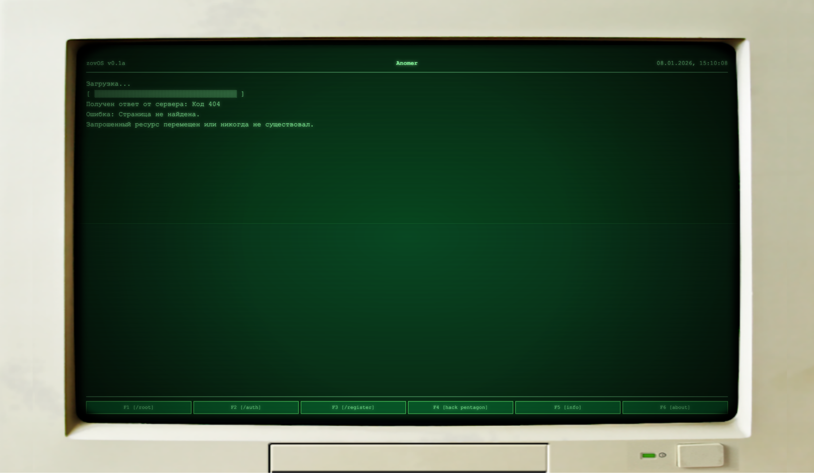

  
  <h1 align="center">Anomer (web)</h1>
  
 Another New Online MEssengeR

  
  
  
  
  
  

# Описание
**Anomer** - это просто еще один мессенджер без нагружающих деталей и усложненного функционала.

Backend - https://github.com/raphaelgolubev/anomer-backend

# Установка
## MacOS или Linux

1. Установите `bun`
2. пока что на этом все