# Референсы для создания UI

- Сайт [сборник интерфейсов из игр](interfaceingame.com)
- Сайт [база данных интерфейсов из игр](gameuidatabase.com)

## Термины

- CRT effect / CRT scanline - эффект ЭЛТ мониторов и сканирующей строки

## Игры, которыми я вдохновлялся

### [Lethal Company](https://store.steampowered.com/app/1966720/Lethal_Company/)

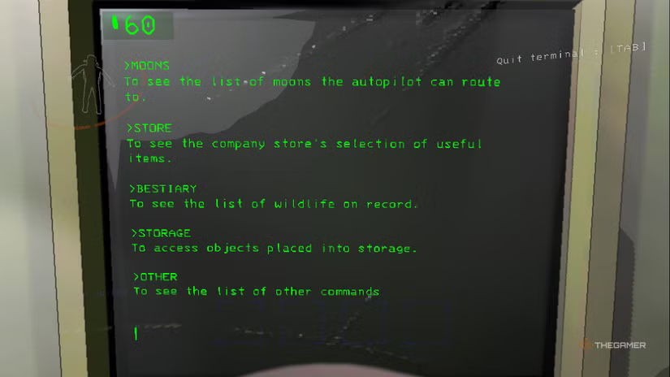
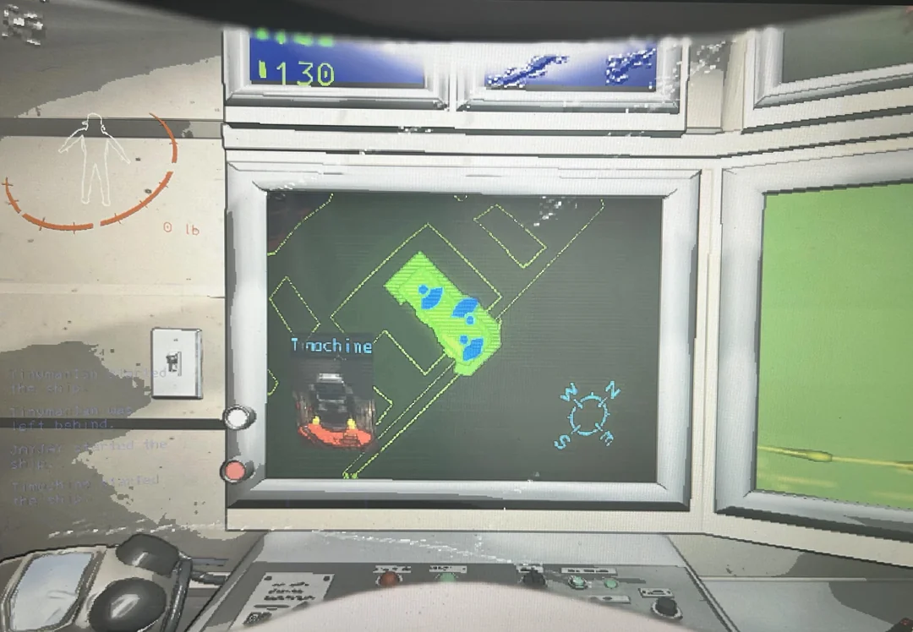
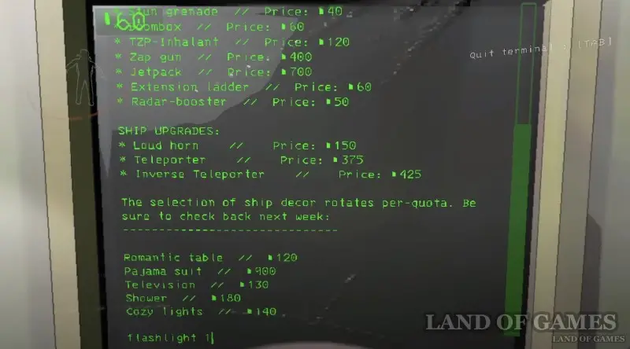

---

### [Far Cry 3: Blood Dragon](https://store.steampowered.com/app/233270/Far_Cry_3__Blood_Dragon/)

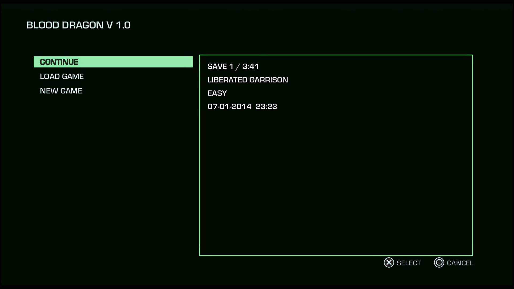
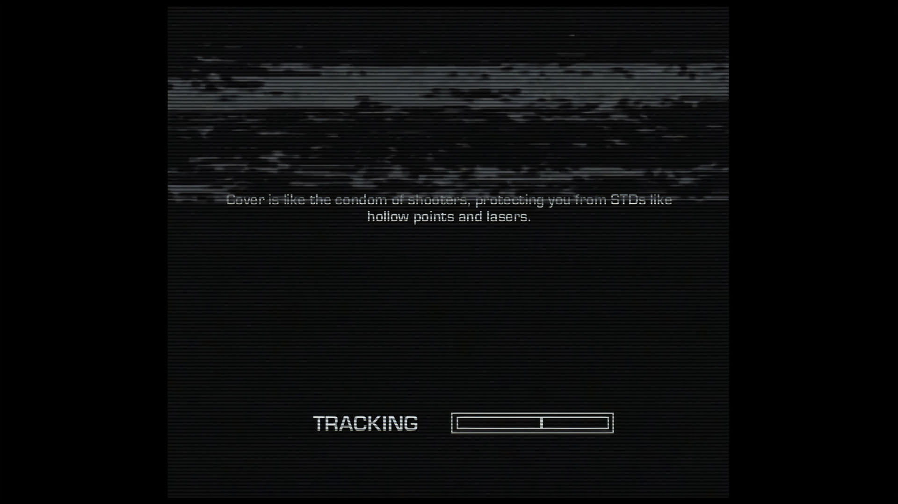
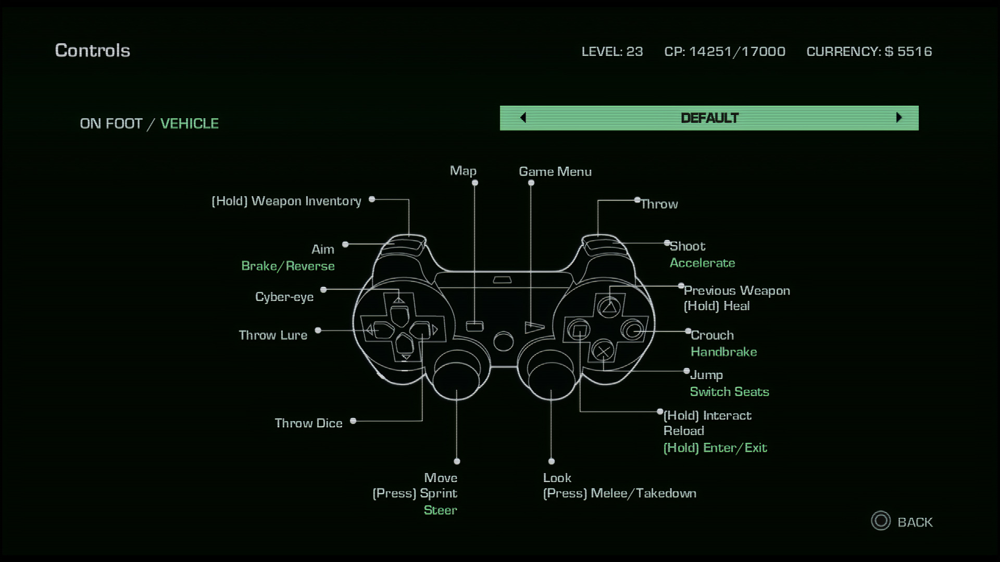

---

### [s.p.l.i.t](https://store.steampowered.com/app/3684610/split/?curator_clanid=45275615)

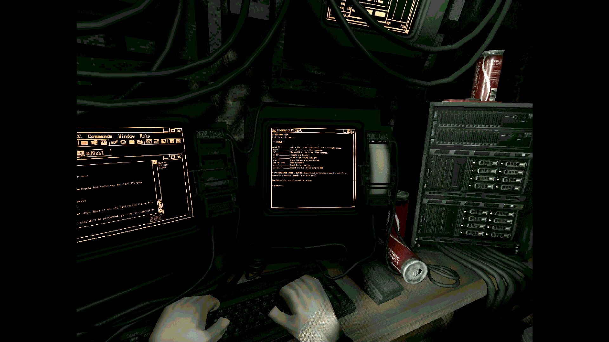
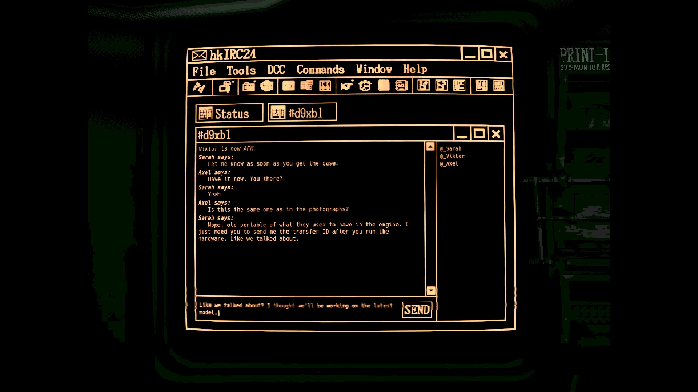
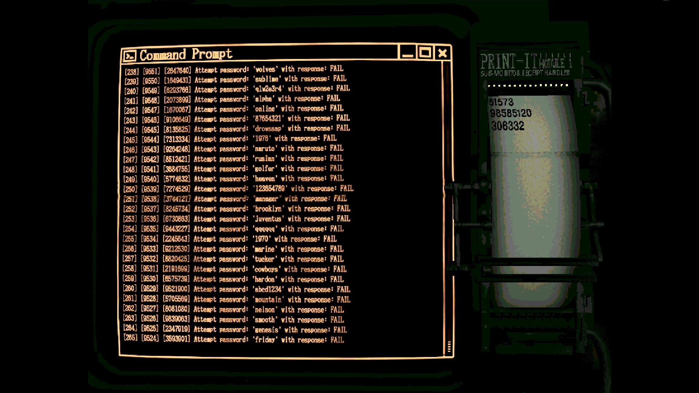

---

## [GTFO](https://store.steampowered.com/app/493520/GTFO/)

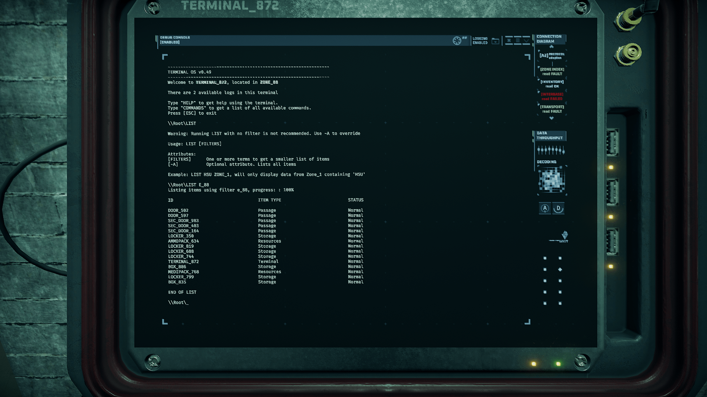

---

## [Routine](https://store.steampowered.com/app/606160/ROUTINE/)

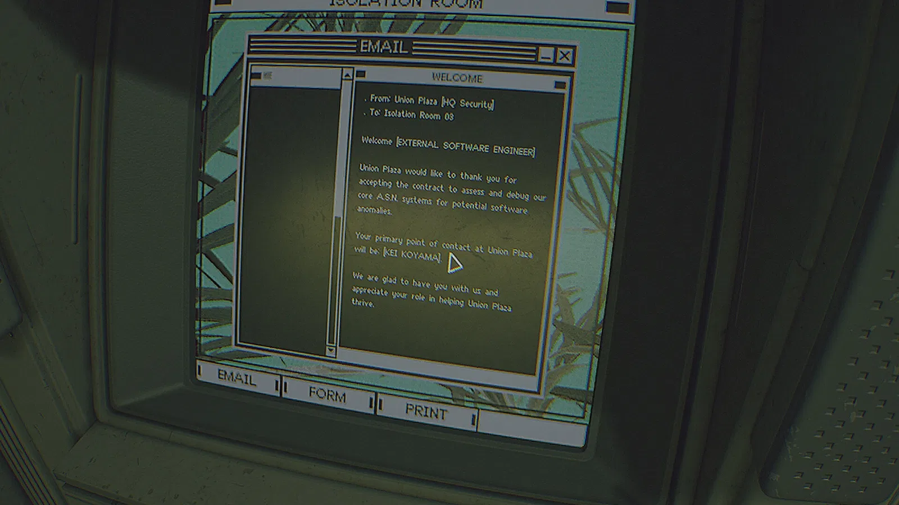

---

## Другие референсы

